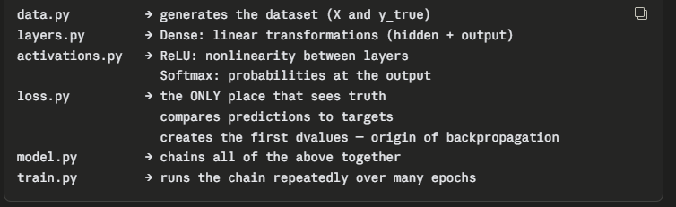
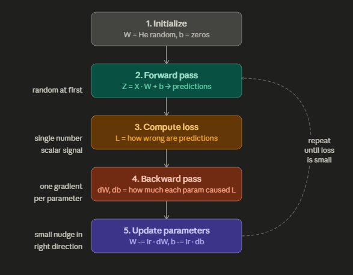
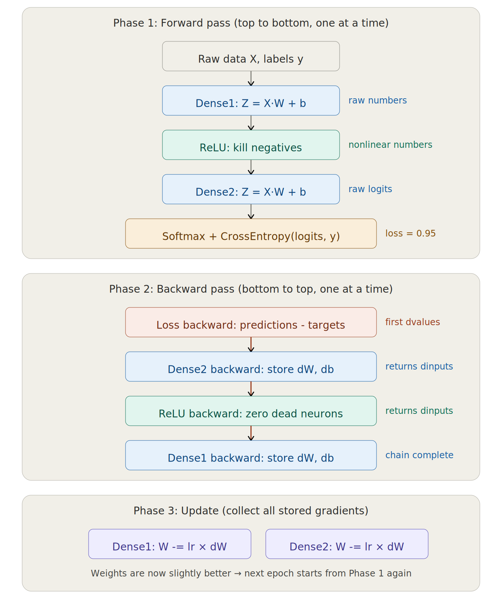
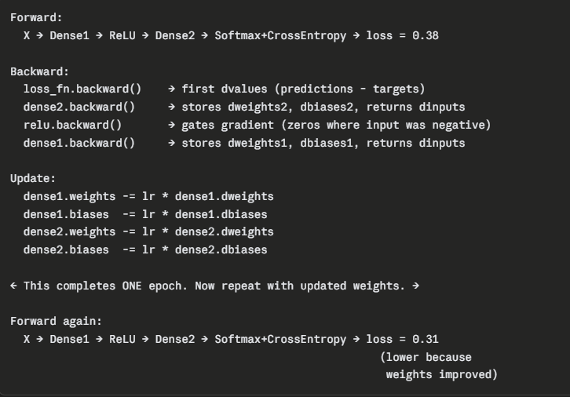
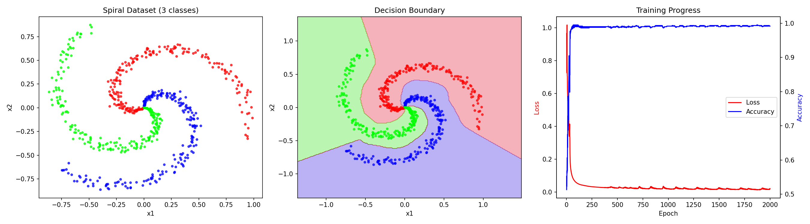

# Neural Network from scratch with NumPy

A fully connected feed-forward neural network built from the ground up using only NumPy. No PyTorch, no TensorFlow, no high-level frameworks. Every component, from weight initialization to backpropagation, is implemented manually.

## Motivation

This project was a self-directed challenge to understand the mathematical and computational foundations of neural networks. Using a framework like PyTorch makes it easy to build networks without truly understanding what happens inside them, the goal here was the opposite: implement every step explicitly to internalize how forward passes, backpropagation, gradients, and optimization actually work.

As a student moving toward the Data Science field, I wanted hands-on familiarity with the core mechanics rather than just the API surface of an existing library.

## What It Does

The network is trained on a synthetic spiral dataset, a classic non-linearly-separable classification problem with three intertwined classes. After training, it correctly separates the three spiral arms with high accuracy, demonstrating that the from-scratch implementation works end-to-end.

## Architecture



The project is split into six modules, each responsible for one concept:

```
data.py          → generates the spiral dataset
layers.py        → Dense (fully connected) layer with He initialization
activations.py   → ReLU, Sigmoid, and Softmax activation functions
loss.py          → Cross-entropy loss (separate and combined with softmax)
model.py         → Sequential network orchestration and training loop
train.py         → entry point: configures, trains, and visualizes
```

The network architecture used in `train.py`:

```
Input (2)  →  Dense(64)  →  ReLU
           →  Dense(32)  →  ReLU
           →  Dense(3)   →  Softmax + Cross-Entropy
```

Optimizer: vanilla stochastic gradient descent (SGD).

## How to Run

```bash
git clone <repository-url>
cd neural-network-numpy
pip install -r requirements.txt
python train.py
```

The script trains for 2000 epochs and generates `images/training-results.png` with three plots: the raw dataset, the learned decision boundary, and the loss/accuracy curves over time.

## Training Flow



Each epoch follows the cycle: forward pass, loss computation, backward pass, and parameter update.





## Results



## Concepts Implemented

- He weight initialization (scaled for ReLU activations)
- Forward propagation through arbitrary layer sequences
- Backpropagation via the chain rule
- ReLU, Sigmoid, and Softmax activations with their derivatives
- Categorical cross-entropy loss
- Combined Softmax + Cross-Entropy for numerical stability and speed
- Vanilla Stochastic Gradient Descent parameter updates
- Decision boundary visualization via meshgrid prediction

## Key Insights from Building This

- A neural network is just a sequence of matrix multiplications interleaved with non-linear functions. The "intelligence" emerges entirely from gradient descent.
- The loss function is the only component that ever sees the truth, every other layer just transforms numbers without knowing if they are right or wrong.
- Combining Softmax and Cross-Entropy into one operation simplifies the gradient to `predictions - targets`. The math behind this elegant result motivates why frameworks ship them together without the need to calculate highly complexes derivatives.
- Numerical stability matters: clipping near zero (specially for ln(x) boundaries), subtracting the max before exponentiating, and normalizing by batch size all prevent training from breaking in subtle ways. 

## Next possible Steps

- Implement additional optimizers (Adam, RMSprop)
- Add regularization (L2, dropout)
- Extend to batch processing with mini-batches
- Apply to a real-world dataset (MNIST or similar)

## Tech Stack

- Python 3
- NumPy (for all computation)
- Matplotlib (for visualization only)
